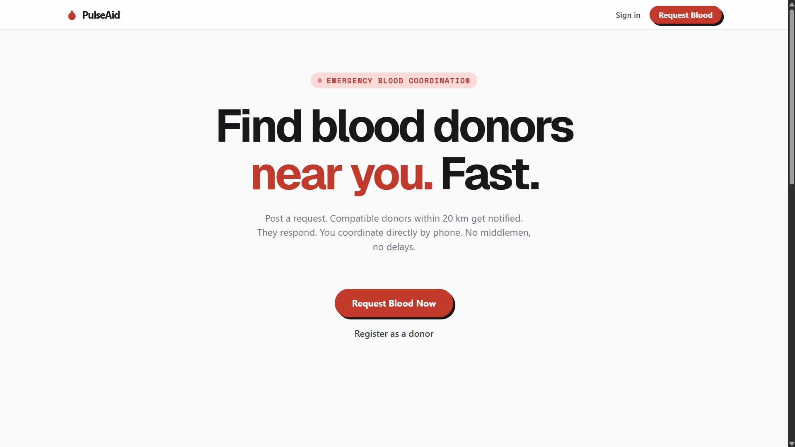

# 🩸 PulseAid
### **The AI-Powered Emergency Blood Command Center**



PulseAid is a project I built to solve a problem that hits home for many: the chaotic, frantic search for blood donors during medical emergencies. 

Instead of relying on scattered WhatsApp forwards and hoping for a miracle, PulseAid is a high-speed, direct coordination platform that connects families with compatible donors in their immediate vicinity. No noise, no spam—just action when every second counts.

---

## 🧠 Why this is different (The AI Edge)
Most platforms fail because they force users to fill out long, tedious forms during a crisis. **I solved this using AI.**

One of the core features I implemented is a **Natural Language Emergency Parser**. Powered by **Groq and Llama-3**, it allows a frantic family member to simply type:
> *"Urgent! Need 3 units of B+ at Manipal Hospital for surgery, please help!"*

The AI instantly extracts the blood group, urgency level, units, and hospital name, auto-filling the entire request flow. It turns panic into structured data in milliseconds.

---

## ⚡ Key Features
- **AI-Driven Entry**: Skip the forms. Type naturally, let the AI handle the data extraction.
- **Precision Alerts**: Donors are only notified if their blood type matches and they are within a 20km radius. 
- **The "Cockpit" Dashboard**: A premium, editorial-style command center that tracks network pulse and emergency requests without the clutter.
- **Availability Toggle**: A "No-BS" way for donors to go invisible when they can't help, preventing unnecessary pings.
- **Privacy First**: Direct phone connection for matched donors—no middlemen, no complex chat interfaces.

---

## 🛠️ The Tech Stack
I chose a modern, high-performance stack to ensure the app is both beautiful and bulletproof:
- **Frontend**: Next.js 15 (App Router) + Tailwind CSS + Framer Motion.
- **AI Engine**: Groq SDK + Llama-3-70b (for sub-200ms parsing).
- **Backend**: Supabase (PostgreSQL + Realtime) & Django.
- **Auth**: Clerk (Secure, modern identity management).

---

## 🚀 Running it locally

### 1. The Frontend (Next.js)
```bash
cd frontend
npm install
# Add your GROQ_API_KEY and CLERK keys to .env.local
npm run dev
```

### 2. The Backend (Django)
```bash
cd backend
python -m venv venv
source venv/bin/activate  # or venv\Scripts\activate on Windows
pip install -r requirements.txt
python manage.py migrate
python manage.py runserver
```

---

## 📍 Road Ahead
- **Automated SMS/WhatsApp Alerts**: Moving beyond app notifications for 100% reach.
- **Geospatial Routing**: Showing donors the exact travel time to the hospital.
- **Smart Cooldown**: Automatic donor "invisible" status after a successful donation.

## License
MIT. Built with heart in Bangalore. 🩸
